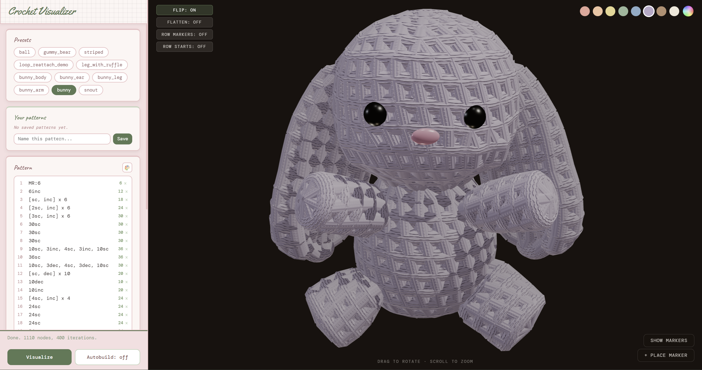

# Skein: Crochet Pattern Visualizer

Skein is a browser tool that renders written crochet patterns as 3D models. Patterns are written in a plain-text notation (`MR:6`, `[sc, inc] x 6`, `blo, 12sc`, etc.), parsed into a graph of stitches, and laid out in 3D using a physics-based graph algorithm (stress majorization).



## How it works

Each stitch is a node, and each "worked into" relationship between stitches is an edge. The pattern's graph is solved into 3D positions with stress majorization (the same class of algorithm used in graph-drawing and network visualization), then rendered as a textured mesh. Irregular pattern shapes (ovals, ruffles, bobbles, uneven increases) settle into their actual shape rather than a generic tube, since positions come from the graph structure rather than a fixed formula.

## Features

- **Notation-based pattern input**: `MR:6`, `6sc`, `[sc, inc] x 6`, `blo`/`flo`, `bobble`, color changes, etc., parsed and validated line by line with inline error messages and live stitch counts.
- **Graph-physics layout**: stitch positions are computed by minimizing a stress function over the pattern graph, so irregular shapes solve into physically plausible 3D positions.
- **Multi-piece assembly** (`fuse:` / `graft:` / `mount:`): joins separately-solved pieces into a single model. Example: two legs fused into a body with a bridging chain, an ear grafted into a seam, an arm mounted onto a body's surface at an angle. Pieces can reference saved patterns or the built-in preset library.
- **Row markers**: click on the solved mesh to place a marker (eye, oval, heart) tied to a specific stitch. Marker positions are recomputed against the solved graph on reload.
- **Autobuild**: builds a piece round by round while typing, using incremental warm-started solves.
- **Built-in presets** covering core techniques (magic ring vs. chain, BLO/FLO reattachment, mid-round color changes, an assembled bunny built from `mount:`-ed pieces), plus locally saved custom patterns.

## Tech stack

- Vanilla JavaScript (ES modules), no framework
- [Three.js](https://threejs.org/) for rendering
- [Vite](https://vitejs.dev/) for dev server / bundling
- Custom parser, graph compiler, and physics solver, with no external
  graph-viz or physics library dependency.

## Getting started

```bash
npm install
npm run dev       # starts a dev server, usually http://localhost:5173
```

```bash
npm run build      # production build to dist/
npm run preview    # preview the production build locally
```

## Project structure

```
index.html                  panel + viewport markup
src/
  style.css                 all styling
  app/
    main.js                 wires everything together, owns the solve/render loop
    patternEditor.js        textarea-based pattern editor, saved-pattern storage
    presets.js              built-in pattern library
    solver.js               orchestrates a solve: parse -> compile ->     physics -> mesh
    markers.js              click-to-place stitch markers, save/restore
    autobuild.js            incremental round-by-round solving
    colorPicker.js          color wheel/hex/rgb picker popover
    scene.js / viewToggles.js / state.js
  lib/
    parser.js               notation -> structured "rounds" (the language front end)
    graph.js                rounds -> node/edge graph (stitches, loops, bulge legs...)
    geometry.js             the physics solve + all post-processing passes
    mesh.js                 graph + solved positions -> Three.js geometry
    color.js / constants.js
```

## Status

Actively developed as a personal project. The notation guide inside the app (collapsible panel under the pattern editor) documents the full syntax with examples for every feature above.